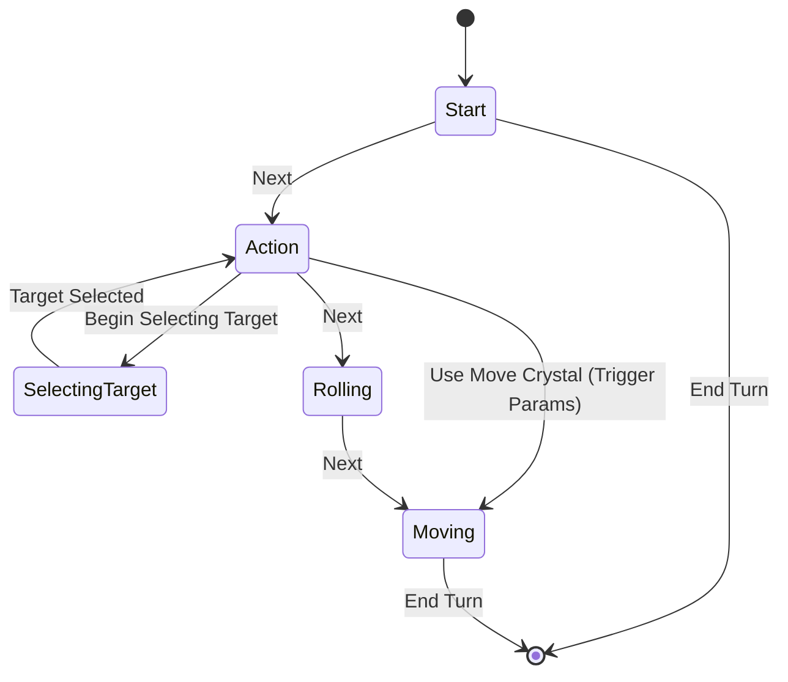

# Phase Manager

```mermaid
stateDiagram-v2
    [*] --> Start
    Start --> Action: Next
    Start --> [*]: End Turn
    Action --> SelectingTarget: Begin Selecting Target
    Action --> Rolling: Next
    Action --> Moving: Use Move Crystal (Trigger Params)
    SelectingTarget --> Action: Target Selected
    Rolling --> Moving: Next
    Moving --> [*]: End Turn
```
