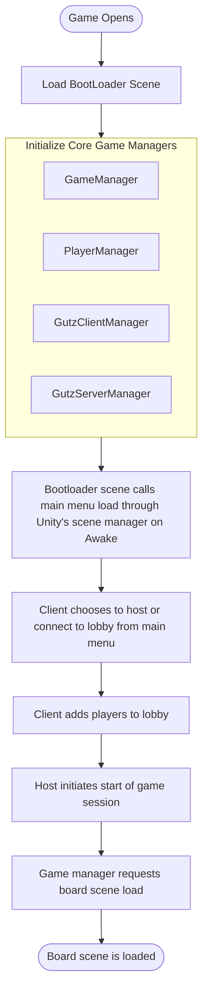

# Network Flow

```mermaid
flowchart TD
    A([Game Opens]) --> B[Load BootLoader Scene]
    subgraph managers [Initialize Core Game Managers]
        GameManager
        PlayerManager
        GutzClientManager
        GutzServerManager
    end
    B --> managers
    managers --> C[Bootloader scene calls main menu load through Unity's scene manager on Awake]
    C --> D[Client chooses to host or connect to lobby from main menu]
    D --> E[Client adds players to lobby]
    E --> F[Host initiates start of game session]
    F --> G[Game manager requests board scene load]
    G --> H([Board scene is loaded])

```
